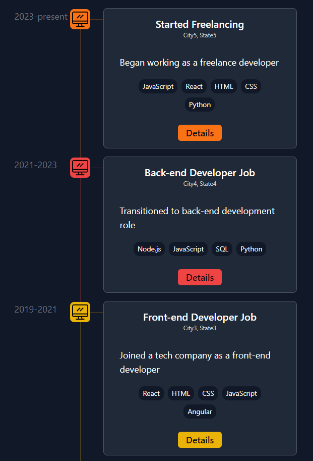
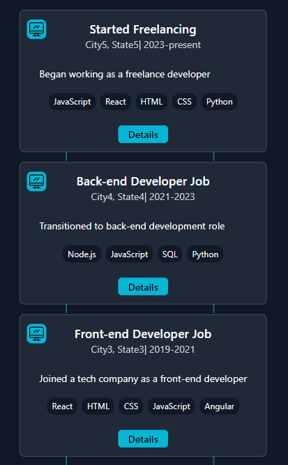

# 🚀 Customizable React Timeline Component

👋 Check out this simple and customizable React Timeline component designed for your portfolio websites. 🌐✨ Powered by Vite for a lightning-fast setup and styled with Tailwind, this component is a game-changer for visually showcasing your journey. 🛠️💻 It's super easy to implement, and I've kept it light with just Tailwind for styling — no unnecessary dependencies!

 

🎥 This component was made as a part of my [YouTube tutorial which you can check out here](https://youtu.be/ncQEnBAoOtA). In the tutorial I will guide you through creating and customizing this component. Don't miss out on elevating your portfolio's storytelling with this simple and effective addition.

If you just want to preview the code locally clone it, navigate to your repo's folder, and run `yarn` and `yarn dev`, or `npm install` and `npm run dev`.
